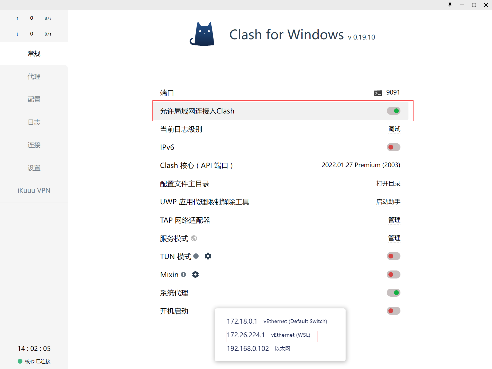
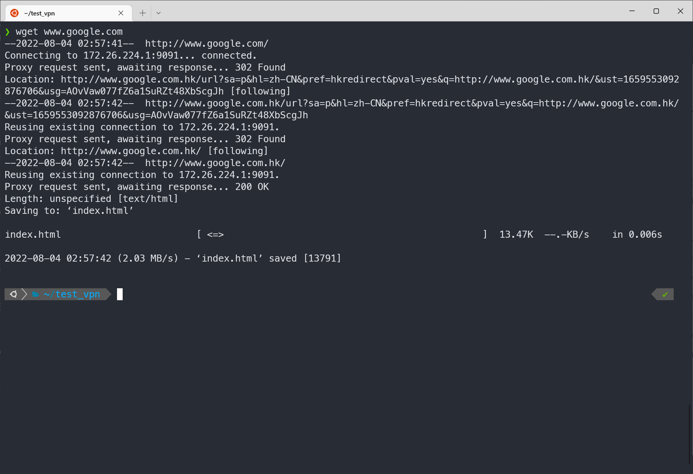
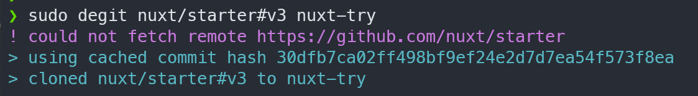

# Degit 使用日记

在完成了pixiv-fanbox的下载插件后，打算放缓迭代的速度，于是将目光投向了又新又潮的 nuxt3；说来惭愧工作多年对跨服务端渲染的经验只有在几次快速迭代中充当工具人，并没有参与真正的设计与开发，为了冲洗掉这又羞又愧的心情带来的空虚而接触这块未系统学习的空白区域。

# Environment
wsl + ubuntu 22.04 TLS + node 16.15.0 + clash

# Install
nuxt3 提供专用的模板下载插件 `nuxi`
```
npx nuxi init nuxt3-app
```


但很快便遇到第一个坑 `could not fetch remote https://github.com/nuxt/starter`  
意思是以为网络原因无法从 `github` 上拉取模板。但奇怪的是报错并没有经过一段时间的请求并超时后出现，而是紧跟着命令行后；  
或许是因为没有使用 `sudo` 而出现的权限问题，
```
sudo npm install nuxi -g
sudo nuxi init nuxt3-app
```
这次 `could not fetch remote https://github.com/nuxt/starter` 等待了一段时间后才出现，网络问题真实存在。

# Vpn
wsl 有自己独立的 `https_proxy` 和 `http_proxy` 全局变量用于代理访问，设置 `clash` 允许局域网访问，并将监听的ip填入到 `https_proxy` 和 `http_proxy` 中  



```
export http_proxy = 'http://172.26.224.1:9091'  # 根据实际IP和端口修改地址
export https_proxy = 'http://172.26.224.1:9091'
```
## 测试链接效果



# ReInstall
再次回到安装步骤，放弃 `nuxi`，改用原生 `degit`，等待数分钟后安装成功
```
sudo npm install degit -g
sudo degit nuxt/starter#v3 nuxt-try
```


# 总结
实际上在安装 `nuxt3` 这件事上使用 `degit` 并不见得是多有效率的事，
1. 一方面是因为网络的原因，国内玩家天生残疾，
2. 另一方面 `nuxt3` 的模板并不复杂，除去 `README.md` 一共5个文件，不超过50行代码，不愿意捣鼓的完全可以把压缩包拉下来解压开来直接用